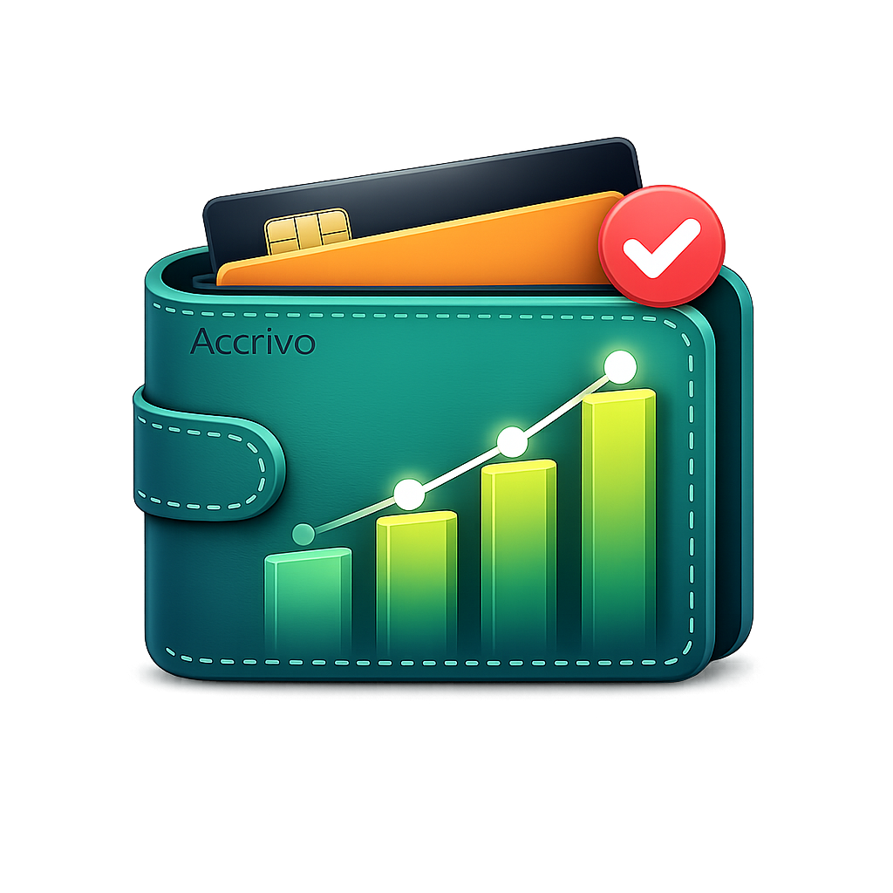

#  Accrivo — Your Personal Financial Operating System

**Privacy-first. Accounting-grade. Surprisingly simple.**

Accrivo is designed for people who have outgrown basic expense trackers but do not want the complexity of traditional accounting software. It helps you understand your complete financial life — what you own, what you owe, what is owed to you, and where your money is moving — while keeping your data entirely under your control.

> **Start as simply as an expense tracker. Grow into a complete wealth management system without changing apps or losing your history.**

&nbsp;

# Why Accrivo Exists

Most finance apps force a compromise:

- **Simple expense trackers** are easy to use but often provide an incomplete picture of your finances.
- **Traditional accounting tools** are accurate but feel overwhelming for everyday users.

Accrivo combines the best of both worlds.

### ✅ Accounting-grade accuracy
**Accuracy**  
Professional double-entry bookkeeping runs silently in the background, ensuring your financial records always remain balanced and reliable.

### ✨ Zero accounting knowledge required
**Simplicity**  
Record transactions naturally while Accrivo handles the accounting logic for you.

### 📈 Deep financial insights
**Insights**  
Go beyond expense tracking with credit monitoring, cash-flow analysis, savings metrics, and wealth insights.

### 🛡️ Absolute data ownership
**Privacy**  
Offline-first and zero-knowledge by design. Your financial data stays under your control.

---

# The Accrivo Philosophy

---

### ✅ 1. Master Your Accruals
Financial health is not just about today's bank balance. It is also about future commitments, pending dues, loans, and money owed to you. Accrivo helps you manage these accruals so you always understand your true financial position.

---

### ✅ 2. Double-Entry, Zero Headaches
Every transaction is accurately modeled as a balanced financial event involving assets, liabilities, income, expenses, and cash flow — without requiring you to think in accounting terms.

---

### ✅ 3. Debt with Context
Instead of showing raw balances alone, Accrivo tracks credit utilization, billing cycles, and available spending capacity to help you make smarter financial decisions.

---

### ✅ 4. Privacy by Default
No forced cloud sync. No data harvesting. No selling of financial information. You decide if, when, and where your data is backed up.

---

# What Makes Accrivo Different?

Most finance apps answer one question:

> **“What did I spend?”**

Accrivo answers the complete set:

- What do I own?
- What do I owe?
- Who owes me money?
- What are my future financial commitments?
- How healthy is my credit usage?
- How much wealth am I building?
- Where is every rupee moving?

That is why Accrivo is more than an expense tracker — it is a **personal financial operating system**.

---

# The Four Pillars of Accrivo

---

### ✅ Track
Capture your day-to-day financial activity effortlessly.
- ➕ **Income**
- ➖ **Expenses**
- 🔁 **Recurring**
- 💼 **Budgets**

---

### 🏛️ Manage
Organize every part of your financial life.
- 🏦 **Accounts**
- 💳 **Credit Cards**
- 📈 **Investments**
- 🤝 **Dues**

---

### 📊 Understand
Turn transactions into actionable intelligence.
- 💰 **Savings Rate**
- 📅 **Runway**
- 🛡️ **Debt Ratio**
- ⏱️ **Credit Insights**
- 🥧 **Asset Allocation**
- 🔄 **Cash Flow**

---

### 🛡️ Protect
Keep your financial data secure and private.
- 📱 **Offline First**
- 🔒 **Encryption**
- ☁️ **Optional Backup**
- 👤 **Data Ownership**

---

# Core Features

---

### 💼 Accounts Management
**Complete portfolio view**  
Manage bank accounts, wallets, physical investments, deposits, and liabilities in one unified system. Group, reorder, and privately mask sensitive balances whenever needed.

---

### 💳 Comprehensive Credit Health
**Cycle-aware**  
Monitor billing cycles, utilization, spending velocity, and available spending capacity to avoid debt traps before they happen.

---

### 📁 Flexible Category Management
**Highly customizable**  
Organize finances your way with drag-and-drop category structures, custom icons, and personalized colors.

---

### 🧾 Intelligent Transaction Entry
**Fast & visual**  
Choose between simple intent-based entry or Advanced Ledger mode with split transactions, live previews, and customizable views.

---

### 🔁 Recurring Transactions
**Automated**  
Automate subscriptions, bills, salaries, and other recurring financial activities with flexible scheduling rules.

---

### 🤝 Managed Dues
**Lending & borrowing**  
Maintain a stress-free record of money lent to or borrowed from friends, family, and other contacts.

---

### 🎯 Envelope-Style Budgeting
**Plan ahead**  
Set spending limits, track category goals, and carry forward budget structures seamlessly between months.

---

### 📊 Advanced Analytics & Reports
**Actionable metrics**  
View savings rate, runway, debt ratio, credit insights, asset allocation, and other wealth-focused metrics at a glance.

---

### 🛡️ Security & Preferences
**Your environment**  
Protect the app with PIN or biometrics, customize themes and currencies, and manage local or cloud backups on your terms.

---

# Designed to Grow With You

Many users start with simple expense tracking. Accrivo is built so that your financial system can evolve without starting over.

### ✨ Your journey with Accrivo
**No data migration required**

---

**Day 1**  
💼 **Track expenses**  
Record income and expenses in the simplest possible workflow.

**As you grow**  
🏛️ **Add accounts & budgets**  
Introduce bank accounts, wallets, recurring transactions, and budgeting.

**Power mode**  
📈 **Manage wealth**  
Unlock investments, liabilities, accruals, credit analysis, and full financial reporting.

---

✅ **No app switching. No data migration. No lost history.**

---

# Who Is Accrivo For?

**Accrivo is ideal for:**

- Individuals who want more than a basic expense tracker.
- Users who value privacy, security, and data ownership.
- People managing multiple accounts, credit cards, investments, or liabilities.
- Anyone seeking long-term financial clarity and wealth growth.
- Users who want accounting-grade accuracy without learning accounting.

---

# Design Principles

**Everything in Accrivo is built around four principles:**

- **Accuracy is non-negotiable**
- **Simplicity in experience, not in logic**
- **User control over automation**
- **Total transparency in financial state**

---

# What’s Coming Next

**Our roadmap includes:**

- 🏷️ Transaction Tags
- ⚡ One-Tap Quick Actions
- 🔄 Enhanced Recurring Rules
- 📷 On-Device Receipt OCR
- 👨‍👩‍👧 Secure Household Sync
- 💱 Multi-Currency Travel Mode
- 🎯 Goal-Based Savings Tracking

---

# The Accrivo Promise

**You should not have to choose between simplicity, accuracy, intelligence, and privacy.**

Accrivo is built to deliver all four.

> **Track expenses simply today. Manage your entire financial life tomorrow.**

&nbsp;

---

### Transparent by Design 💎
*Supported by users, not advertisers. Accrivo is free to use with optional premium and referral-based features. We will never harvest or monetize your financial data.*
